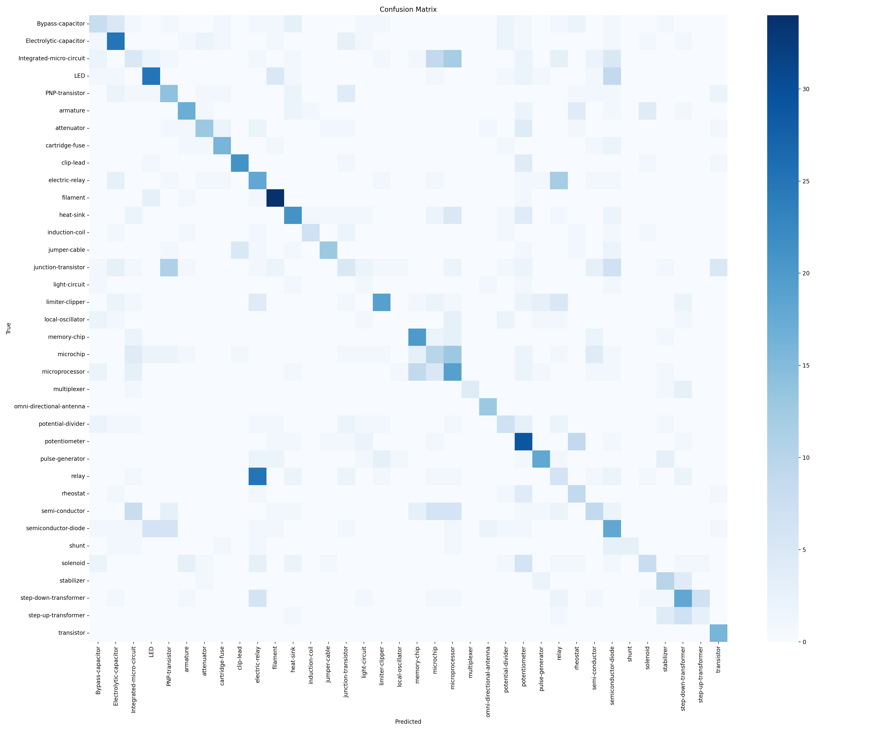

# NeuralNet Electronic Parts Classifier

An image classification project for recognizing electronic components using convolutional neural networks and transfer learning. The repository is structured as a portfolio-ready ML application with training, evaluation, inference, and a Streamlit interface.

## Overview

- Task: multi-class image classification
- Domain: electronic component recognition
- Backbones: ResNet18 baseline and EfficientNet-B0 final backbone
- Interface: Streamlit app for interactive image upload and top-k predictions

## Results

| Model | Test Accuracy | Test Macro-F1 |
|------|---------------|---------------|
| ResNet18 | 0.3946 | 0.4053 |
| EfficientNet-B0 | 0.4323 | 0.4391 |

EfficientNet-B0 improved both overall accuracy and macro-F1 over the ResNet18 baseline.

## Error Analysis

The model performs well on some visually distinctive categories, but still struggles with classes that are visually similar or underrepresented.

Common failure patterns:

- confusion between visually similar components such as relay-like and transistor-like categories
- lower recall for classes with fewer training images
- sensitivity to viewpoint, lighting, and very small object details

This is why macro-F1 is an important metric here: it better reflects performance across all classes, not only the largest ones.

## Known Limitations

The model may confuse visually similar components, especially when images have poor lighting, unusual angles, or very small components.

## Dataset

The dataset is not included in this repository because image datasets can be large.  
Expected folder structure:

```text
data/raw/
	Bypass-capacitor/
	Resistor/
	Diode/
	Transistor/
```

During training, the pipeline automatically creates `data/train`, `data/val`, and `data/test` if they do not already exist.

## Project Structure

```text
app/                 # Streamlit application
data/                # Local dataset and generated splits
docs/                # Screenshots and visual assets
models/              # Local model artifacts
reports/             # Metrics, reports, and figures
src/                 # Training, evaluation, and prediction code
```

## Analyst Notebook

For a full analytics-oriented walkthrough (KPI summary, learning curves, per-class diagnostics, confusion matrix review, and actionable recommendations), open:

- [docs/project_analysis_notebook.ipynb](docs/project_analysis_notebook.ipynb)

## Quick Start

1. Install dependencies:

```bash
pip install -r requirements.txt
```

2. Train the model:

```bash
python -m src.train --model efficientnet_b0
```

3. Evaluate on the test split:

```bash
python -m src.evaluate
```

4. Run inference for a single image:

```bash
python -m src.predict path/to/image.jpg --top-k 3
```

5. Launch the Streamlit app:

```bash
streamlit run app/streamlit_app.py
```

## Pipeline Notes

- If no train/validation/test split exists, it is generated automatically from `data/raw`.
- Strong data augmentation is applied during training to improve robustness on visually similar classes.
- Weighted sampling is used to reduce the impact of class imbalance.
- The best checkpoint is saved to `models/best_model.pt`.
- Metrics are saved to `reports/metrics.json`.
- Evaluation exports a labeled confusion matrix to `reports/figures/confusion_matrix.png`.
- Per-class evaluation details are exported to `reports/classification_report.json` and `reports/problematic_classes.json`.

## Streamlit Preview



## Future Improvements

- collect more examples for low-support classes
- test higher-resolution inputs and longer training schedules
- analyze the most confused class pairs and add targeted augmentations

